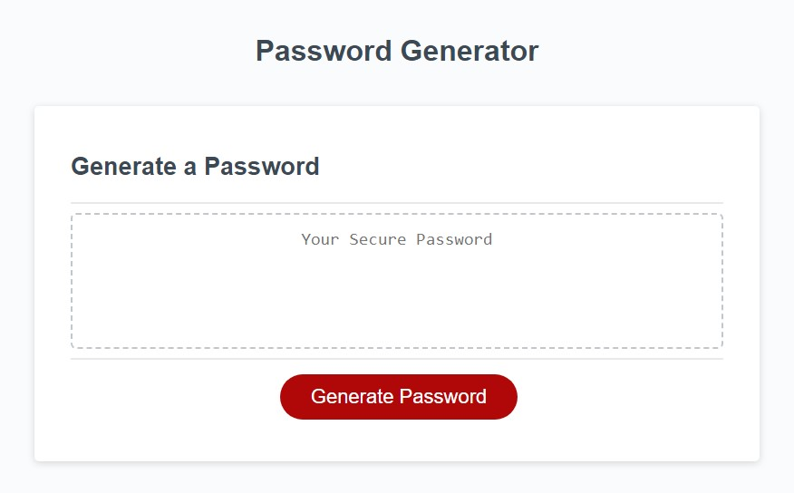

# brand-new-password-generator

## Description

This webpage provides a way for employees to create a new randomly generated password 
given prompts to customize their password to their requirements. The password must be
betweeen 8-128 characters and the website shall notify the employee of an invalid
password length. In addition to length verification there is also measure put in place
to insure at least one character type criteria is met. Once all the prompts and criteria
has been completed the program will generate and print the new passward on the page.

## Usage
[Live URL](https://eguerreroxx.github.io/brand-new-password-generator/)

## Screenshot

